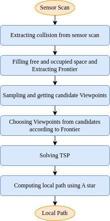

# turtlebot_exploration_planning

This ROS package develops TARE planner which forked from [TARE](https://github.com/caochao39/tare_planner) for the Turtlebot2 robot. The package was designed in [stonefish](https://github.com/patrykcieslak/stonefish) simulator using [Turtlebot2](https://bitbucket.org/udg_cirs/turtlebot_simulation/src/master/) Simulation Packages. The package was tested on ROS Noetic running on Ubuntu 20.04 Machine.

## Overview
- Local Planner: In Figure local_planner_flow_chart, there are 6 steps to compute local path. First, upon receiving sensor scans, the algorithm derives collisions from these scans and simultaneously downsamples the data to reduce computational load. Collision derivation is based on the height and slope of objects.
Second, from the sensor scans and derived collisions, the algorithm identifies free spaces and occupied spaces. Subsequently, the frontier is calculated and identified based on these spaces. Specifically, the frontier is the boundary between unknown space and free space.
Third, the algorithm samples viewpoints within the local planning horizon. Viewpoints that satisfy the conditions of no collision, connectivity, and being within free space are selected as candidate viewpoints.
Fourth, based on the set of candidate viewpoints and the identified frontier, the algorithm calculates the number of frontier points each candidate viewpoint can observe, using sensor parameters such as distance and elevation angle. The candidate viewpoints are then sorted in descending order based on the number of frontier points they can observe, and viewpoints are selected starting from the highest rank. Note that after selecting a viewpoint, the frontiers observed by that viewpoint are excluded from the remaining frontiers to be observed by subsequent viewpoints. The selection process concludes when all frontiers have been observed or all candidate viewpoints have been selected.
Fifth, the Traveling Salesman Problem (TSP) is applied to the list of selected viewpoints to determine the optimal path that passes through all viewpoints, thus determining the sequence of viewpoints along the path.
Finally, to calculate the path between two viewpoints, the A* algorithm is used to find the optimal path. The A* algorithm is applied to a graph of the selected candidate viewpoints, ensuring connectivity and precomputed distances between viewpoints. This results in a complete local path.

<div align="center">
    
</div>


- Global Planner: The exploration space outside the local planning horizon is divided into equal cuboid subspaces. Each subspace stores data about covered and uncovered surfaces. This data is kept for storage purposes, while the data within is actively updated during exploration. Each subspace has one of three statuses: "unexplored", "exploring", or "explored". A subspace is "unexplored" if it contains no surfaces, "explored" if it only contains covered surfaces, and "exploring" if it contains any uncovered surfaces. Only the "exploring" subspaces are considered in global planning.

    The global planning objective is to find a global path that traverses the current viewpoint and the centroid of each exploring subspace. A sparse random roadmap is constructed in the traversable space expanded from the past trajectory, and the A* algorithm is used to find the shortest paths between subspaces. The overall procedure involves constructing a distance matrix of paths on the roadmap, solving a TSP to order the subspaces, and then connecting these paths to form the global path.

    First, it constructs a distance matrix and solves a TSP to determine the order of subspaces. Two points where global path intersects the boundary of local planning horizon are identified. Local planner is then used to compute the local path. Finally, local path and global path are concatenated to become exploration path.

    When the local path within is complete, the vehicle transitions to these subspaces to continue exploration. The algorithm implicitly manages the transition between exploration and relocation.


## Dependencies

This package has the following dependencies:

- ROS Noetic
- Stonefish Simulator
- Turtlebot Simulation Packages
- PCL Library
- Eigen Library
- Boost Library


## Installation

To install the turtlebot_graph_slam package, follow these steps:

### Install the dependencies:
1. ROS Noetic: Follow the instructions [here](http://wiki.ros.org/noetic/Installation/Ubuntu).
2. Stonefish Simulator: Follow the instructions [here](https://github.com/patrykcieslak/stonefish)
3. Turtlebot Simulation Packages: Follow the instructions [here](https://bitbucket.org/udg_cirs/turtlebot_simulation/src/master/)
4. PCL Library: Follow the instructions [here](https://pointclouds.org/downloads/)
5. If you don't have Eigen and Boost libraries installed, you can install them using the following commands:
    ```
    $ sudo apt install libeigen3-dev
    $ sudo apt install libboost-all-dev
    ```
### Build the package:

To build the turtlebot_graph_slam package, follow these steps:
1. Clone the repository into your ROS catkin workspace:
    ```
    $ git clone https://github.com/LeoPhamVN/turtlebot_exploration_planning
    ```

2. Build the package:
    ```
    $ cd ~/catkin_ws
    $ catkin build
    ```
    if you dont have catkin tools installed, you can install it from [here](https://catkin-tools.readthedocs.io/en/latest/installing.html)

3. Source the setup file:
    ```
    $ source devel/setup.bash
    ```
    You can add this line to your `.bashrc` file to run it automatically when you open a new terminal.
    
4. If while building the package can not find the PCL, Eigen and Boost library.

## Usage

### IMPORTANT!!
1. To launch package, launching the files:
```
$ roslaunch turtlebot_exploration_planning explore_sim.launch
```

## Parameters

The turtlebot_exploration_planning package provides the following parameters:

- `sim`: [sim](/config/sim.yaml).

## Results
1. ICP Alignment:
<div align="center">

</div>

2. Simulation Testing:

<div align="center">

</div>

3. Real World Testing:

<div align="center">

</div>

The testing video can be found on [Youtube](https://youtu.be/LJ4F1GPrkgc?si=MMji7D_SDVsXrU04)

## Future Work
1. Tuning the parameters for better performance.
2. Develop planner with narrow field of view sensor such as camera.


### Lastly

*Don't forget to touch some grass!!*

## Contact

If you have any questions or suggestions, feel free to open an issue or contact me by [Email](mailto:phamthanhloc.bkhn@gmail.com).